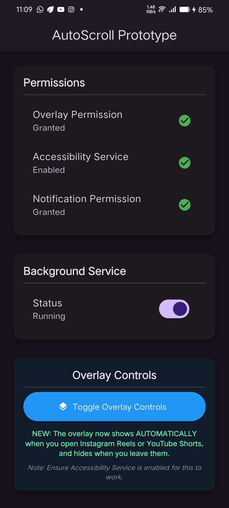
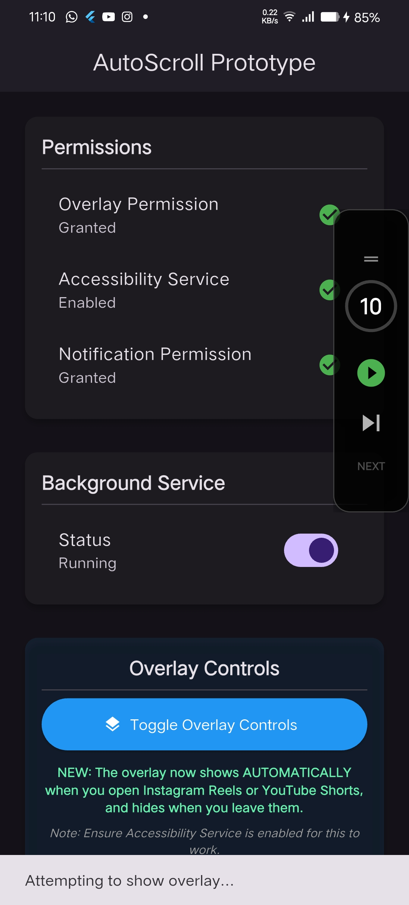

# AutoScroll Pro 🚀

[](https://flutter.dev)
[](https://developer.android.com)
[](https://opensource.org/licenses/MIT)

**AutoScroll Pro** is a high-performance Flutter application designed to automate scrolling on popular short-form video platforms like Reels, TikTok, and YouTube Shorts. It provides a seamless, hands-free viewing experience through a smart floating overlay.

---

## ✨ Key Features

- 📱 **Smart Floating Overlay**: Draggable control panel that floats over other apps.
- ⏱️ **Auto-Countdown**: Configurable timer that automatically swipes to the next video.
- 🎯 **Target App Awareness**: Automatically shows/hides the overlay when entering or leaving supported apps.
- 🚀 **Background Processing**: Reliable operation even when the main app is in the background.
- 🛠️ **Accessibility-Powered**: Uses native Android Accessibility Services for precise, system-level swipe gestures.
- 🎨 **Modern UI/UX**: Sleek dark-themed interface with glassmorphism effects.

---

## 📸 Screenshots

<p align="center">
  
  
</p>

---

## 🛠️ Architecture & Tech Stack

The project utilizes a robust multi-layered architecture:

- **Frontend**: Flutter & Riverpod (State Management)
- **Overlay**: `flutter_overlay_window` for system-level UI.
- **Background**: `flutter_background_service` for persistent operations.
- **Native Bridge**: Custom Kotlin MethodChannels and Accessibility Services.
- **Communication**: Event-driven bridge between Main Isolate, Background Service, and Overlay.

---

## 🚀 Getting Started

### Prerequisites

- Flutter SDK (latest stable)
- Android Studio / VS Code
- Android Device (API 24+)

### Installation

1. **Clone the repository**:
   ```bash
   git clone https://github.com/dipak-github/autoscroll_app.git
   ```

2. **Install dependencies**:
   ```bash
   flutter pub get
   ```

3. **Required Permissions**:
   The app requires two critical permissions to function:
   - **Display over other apps**: For the floating control window.
   - **Accessibility Service**: To perform the swipe gestures.

4. **Run the app**:
   ```bash
   flutter run
   ```

---

## 📖 How It Works

1. **Activation**: Enable the Background Service and grant permissions from the main screen.
2. **Detection**: Open a supported app (e.g., Instagram Reels).
3. **Control**: The floating overlay will appear automatically.
4. **Automation**: Hit **Play** to start the auto-scroll timer or use **Next** for a manual swipe.

---

## 🛡️ Privacy & Security

This app uses the **Accessibility Service API** solely for the purpose of simulating swipe gestures. It **does not** collect, store, or transmit any user data, screen content, or personal information.

---

## 🤝 Contributing

Contributions are welcome! If you'd like to improve the app, please:
1. Fork the repository.
2. Create a feature branch.
3. Submit a pull request.

---

## 📄 License

This project is licensed under the MIT License - see the [LICENSE](LICENSE) file for details.

---

<p align="center">
  Made with ❤️ by Dipak
</p>
