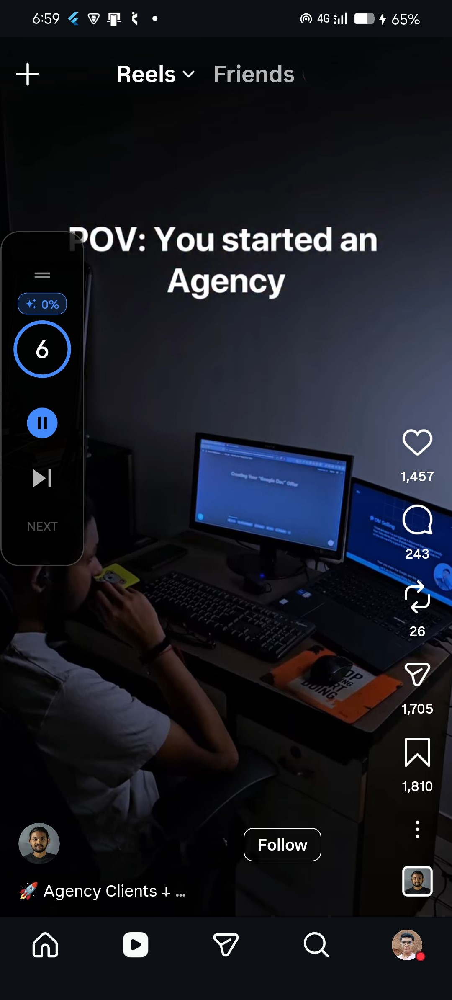

# AutoScroll Pro - Production-Ready Flutter Application

A professional auto-scroller for short-form video apps (TikTok, Instagram Reels, YouTube Shorts) with floating overlay controls and intelligent background service support.

## 🎯 Project Overview

AutoScroll Pro is a production-ready Flutter application that provides automated scrolling functionality for popular short-form video platforms. The app features a floating overlay interface, smart timing controls, and comprehensive analytics tracking.

## 📱 Screenshots

<p align="center">
  
  
  
</p>

## ✨ Key Features

### Core Functionality

- **Automated Scrolling**: Intelligent auto-scroll with customizable intervals (5-60 seconds)
- **Floating Overlay Controls**: Draggable overlay widget for in-app control
- **Target App Detection**: Automatically shows/hides overlay when entering/exiting supported apps
- **Background Service**: Persistent service for reliable operation

### Advanced Features

- **AI Attention Mode**: Smart, content-aware scrolling based on your attention and audio context
- **Humanize Mode**: Random variance (±0-10s) to simulate natural scrolling patterns
- **Sleep Timer**: Auto-stop after 10min, 30min, 1hr, or 2hrs
- **Usage Statistics**: Track scroll count, usage time, and activity history
- **Analytics Tracking**: Comprehensive event logging for user behavior insights
- **Offline-First & Privacy-Centric**: All learning data and stats stored locally with SharedPreferences

### Production-Ready Enhancements

- **Clean Architecture**: Separation of concerns with services, providers, and UI layers
- **State Management**: Riverpod for reactive and efficient state handling
- **Error Handling**: Result type pattern for robust error management
- **Reusable Components**: Common widgets (GlassCard, SectionTitle, GradientButton, etc.)
- **Centralized Theme**: Consistent design system with AppTheme
- **Service Layer**: Dedicated managers for background service, analytics, and preferences
- **Performance Optimized**: Minimal rebuilds, const constructors, efficient async handling

## 🧠 AI Attention Mode (Smart Scroll)

The app features an intelligent **Attention Engine** that learns your viewing preferences per app without tracking you.

### How it works:

1. **Audio Detection**: If music/audio is playing, the AI assumes you are engaged and **increases** the scroll delay (1.5x slower).
2. **Watch Time Learning**: It tracks how long you watch different apps before scrolling and builds a rolling average.
3. **Manual Overrides**: If you manually scroll back (indicating the auto-scroll was too fast), the AI learns to slow down.
4. **Rapid Skips**: If you skip content quickly, the AI learns to speed up.

**Indicators:**

- A blue **AI Badge** with a confidence score (e.g., "AI 85%") appears on the overlay when active.
- The countdown timer automatically adjusts based on the AI's recommendation.

> **Privacy Note**: All learning happens strictly **on-device**. No data is ever sent to the cloud. You can reset the learning model at any time from the settings.

## 📁 Project Structure

```
lib/
├── core/
│   ├── app_theme.dart          # Centralized theme and design tokens
│   ├── constants.dart          # App-wide constants
│   └── result.dart             # Result type for error handling
├── providers/
│   └── settings_provider.dart  # Settings state management with Riverpod
├── services/
│   ├── analytics_service.dart          # Event tracking and analytics
│   ├── background_service_manager.dart # Background service lifecycle
│   ├── preferences_service.dart        # Centralized preferences management
│   └── scroll_service.dart             # Native scroll bridge
├── ui/
│   ├── widgets/
│   │   └── common_widgets.dart # Reusable UI components
│   ├── main_screen.dart        # Primary app interface
│   ├── overlay_screen.dart     # Floating overlay controls
│   └── statistics_screen.dart  # Usage statistics and analytics
└── main.dart                   # App entry point and initialization
```

## 🏗️ Architecture

### Pattern: Clean Architecture + MVVM

- **Presentation Layer**: UI screens and widgets
- **Business Logic Layer**: Riverpod providers and notifiers
- **Data Layer**: Services for analytics, preferences, and native bridges
- **Core Layer**: Shared utilities, constants, and types

### State Management: Riverpod

- `SettingsNotifier`: Manages app settings with analytics integration
- `sharedPreferencesProvider`: Provides SharedPreferences instance
- Reactive updates with minimal rebuilds

### Services

1. **BackgroundServiceManager**: Handles foreground service lifecycle
2. **AnalyticsService**: Tracks events and user behavior
3. **PreferencesService**: Centralizes all SharedPreferences operations
4. **ScrollService**: Native platform channel for accessibility-based scrolling

## 🎨 Design System

### Theme

- **Dark Mode**: Premium dark theme with gradient backgrounds
- **Colors**: Blue/Purple gradients, glassmorphism effects
- **Typography**: Clean, modern text styles with proper hierarchy
- **Components**: Consistent glass cards, buttons, and indicators

### UI Components

- `GlassCard`: Frosted glass effect container
- `SectionTitle`: Uppercase section headers
- `GradientButton`: Animated gradient buttons
- `LoadingIndicator`: Consistent loading states
- `EmptyState`: Placeholder for empty data

## 📊 Analytics & Tracking

### Events Tracked

- `app_opened`: App launch
- `service_started/stopped`: Service lifecycle
- `scroll_triggered`: Each scroll action
- `settings_changed`: Configuration updates
- `permission_granted/denied`: Permission states
- `overlay_shown/hidden`: Overlay visibility
- `sleep_timer_activated`: Sleep timer usage

### Usage Statistics

- Total scroll count
- Total usage time
- Last active date
- Recent activity log (last 50 events)
- Event history with timestamps

## 🔧 Setup & Installation

### Prerequisites

- Flutter SDK ^3.10.4
- Android SDK (API 21+)
- Dart SDK

### Dependencies

```yaml
dependencies:
  flutter_riverpod: ^3.1.0
  shared_preferences: ^2.2.3
  flutter_overlay_window: ^0.5.0
  flutter_background_service: ^5.0.10
  permission_handler: ^12.0.1
  device_info_plus: ^12.3.0
```

### Installation

```bash
# Clone the repository
git clone <repository-url>

# Navigate to project directory
cd autoscroll_app

# Get dependencies
flutter pub get

# Run the app
flutter run
```

### Required Permissions

- **Overlay Permission**: For floating controls
- **Accessibility Service**: For scroll automation
- **Notification Permission**: For foreground service (Android 13+)

## 🚀 Usage

1. **Grant Permissions**: Allow overlay, accessibility, and notification permissions
2. **Configure Settings**: Set scroll interval, random variance, and sleep timer
3. **Start Service**: Toggle the master switch
4. **Open Target App**: Navigate to TikTok, Reels, or Shorts
5. **Use Overlay**: Control scrolling with the floating overlay
6. **View Statistics**: Tap the chart icon to see usage stats

## 🔒 Privacy & Data

- **Local-First**: All data stored locally on device
- **No External Tracking**: Analytics stay on-device
- **No Network Requests**: Fully offline functionality
- **User Control**: Clear history and reset anytime

## 🎯 Production Optimizations

### Performance

- Const constructors for static widgets
- Minimal widget rebuilds with Riverpod
- Efficient async operations
- Memory leak prevention (proper disposal)

### Code Quality

- Strict linting with `flutter_lints`
- Proper error handling with Result type
- Comprehensive documentation
- Separation of concerns

### Scalability

- Modular service architecture
- Easy to extend with new features
- Centralized configuration
- Reusable components

## 🔮 Future Enhancements

### Planned Features

- **Multi-App Profiles**: Different settings per app
- **Gesture Customization**: Swipe patterns and speeds
- **Cloud Backup**: Optional settings sync
- **Advanced Analytics**: Charts and insights
- **Themes**: Multiple color schemes
- **Accessibility**: Screen reader support
- **Localization**: Multi-language support

### Technical Improvements

- **Unit Tests**: Comprehensive test coverage
- **Integration Tests**: E2E testing
- **CI/CD**: Automated builds and releases
- **Crash Reporting**: Sentry/Firebase integration
- **Performance Monitoring**: Real-time metrics

## 📝 License

MIT License - See LICENSE file for details

## 🤝 Contributing

Contributions are welcome! Please follow these guidelines:

1. Fork the repository
2. Create a feature branch
3. Follow existing code style
4. Add tests for new features
5. Submit a pull request

## 📧 Support

For issues, questions, or suggestions:

- Open an issue on GitHub
- Check existing documentation
- Review code comments

---

**Built with ❤️ using Flutter**
